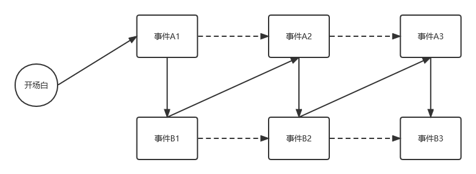

# 规则
 
## 时序图展示规则

时间层级指：世纪（百年）、年代（十年）、年、月、日、时、分、秒。定义世纪为高层级，秒为低层级。

每个事件都属于某个时间层级。判定方式为：**该事件起始和结束时间之间的长度能够达到某一单位的分度值的最小上界**。如：2年 -> 年，114分钟 -> 小时，364天23小时59分钟59秒 -> 天。

事件的展示方式，按照当前时序图所处时间层级与该事件时间层级的关系所决定：
* 对于等于该事件的时间层级的情况：
  * 如果该事件有与其时间层级相同的子事件，则优先展示所有子事件，而不对该事件本身进行展示；
  * 否则，正常展示该事件；
* 对于高于该事件的时间层级的情况，按照*短事件*方式进行展示；
* 对于低于该事件的时间层级的情况：
  * 优先展示该事件在当前时间层级的子事件；
  * 若该事件是原子事件，按照*长事件*方式进行展示。

短事件展示方式为：在该事件所在时间单位处新建一个虚拟的父事件，该父事件的长度设定为当前时间层级的分度值，名称为“若干事件”，子事件为所有起始时间在该单位、且长度小于该单位的事件。

长事件展示方式待定。

## 事件的关系如何建模

有三种有关“事件关系”的设施。

### 关系

事件之间的单向边。具有如下性质：
* 关系类别（强烈因果、影响、伏笔等类别）；
* 属于哪个关系图。一个关系可以属于多个图，也可以不属于任何图，是多对多的关系；
* 该关系的详细描述；

### 关系图

由多个事件和它们之间的关系构成的图。用于表达**事件之间实在的逻辑**关系，而**不必与叙事逻辑相吻合**。
 
当一个新的事件被加入一张图时，默认行为为：将该事件与当前图中已有的事件之间的所有关系也加入到该图中。

也可以手动选择哪些关系被加入到图中。

### 父事件

由**多个关系图**构成的抽象事件。

父事件可以有独立的事件详细描述、独立的事件关系等，但不能有独立的角色关联：父事件所关联的角色为其包含的所有子事件中参与的角色。

单个事件也可以被加入到某个父事件中（作为没有边的图来看待）。

父事件的起始和结束将会是所有关系图中所有事件中最早发生和最晚结束事件的相应时间。

## 叙事线该如何设计

将“故事”和“话语”分离，即：最终构建出的叙事线是一条**独立的链表**，其中的节点称为**叙事节点**；按照叙事的先后依次将叙事节点进行连接，即构成最终的叙事线。

* 每一个叙事节点承担着一定的叙事功能，可能直接对应一个事件节点（即对这件事情进行叙述），但也有可能对应其它类型的信息（引用外部材料，比如《时间之外的往事》、“叙事者”脱离故事的陈述等）；
* 每一个叙事节点有着独立的**元信息**，如：
  * 该叙事节点由谁来进行叙述（某个角色，或是第三方“叙事者”等）；
  * 外部文档链接（该叙事节点对应着作品的真正文本的哪一部分）等；

在构建叙事线时，可以先将某个选定的关系图放在流程图画板上，**将关系图中的边用虚线表示**；随后由用户来决定是否要应用关系图中的某条连通路径来作为叙事线的一部分，**将这一路径中的边转为实线表示**。通过这样的方式，可以将事件的实际逻辑复用到叙事逻辑中（这一点在大多数作品中都非常常见），能够加快叙事线的构建；即使用户打算采用特殊的叙事手法，从而不去使用实际逻辑作为叙事逻辑，关系图仍能作为一个很好的提示。

如上图展示了对两个并行进行的过程进行交错叙述的叙事线。事件A1到A3以及B1到B3有依次顺承的关系，因此它们之间用虚线连接；叙事线按照A1、B1、A2、B2、A3、B3的顺序进行叙事，因此构成锯齿形的链表。

除此之外，用户也可以自主选择当前叙事线的末尾应该连接何种节点，比如新建一个引用外部信息的叙事节点。

## 是否还需要更多新功能

好像还需要添加一个元信息组件，用于描述世界观等信息。

# 参考

* 《作家之旅》1：八种人物原型和故事的十二个阶段 - 郭少川的文章 - 知乎 https://zhuanlan.zhihu.com/p/77784781
