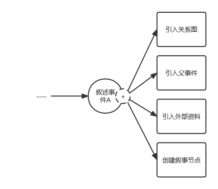

# 欢迎来到开罗尔计划！

开罗尔计划是一个辅助创作者进行创作的叙事建模工具。

# 介绍

开罗尔计划的主要页面为**工作台**，在工作台上可以放置多个组件，从而可以看到多个信息源的内容。

组件可以通过拖拽的方式放置在工作台上，可以放置在工作台的四角、侧边和中间位置。

组件之间能够进行联动，如：在时序图上选择某一个事件后，如果编辑器组件也存在于工作台上，则编辑器将会呈现该选定事件的详细内容；如果编辑器没有在工作台上，则在点击某个事件后将会以模态框的形式进行展现。

## 组件

### 时序图

时序图是开罗尔计划的核心组件。这个组件以色块的形式展现了事件发生和结束的时间，以及若干事件发生时间的重叠、递进关系。与传统的甘特图的不同点在于，该时序图是**专门为描述叙事关系而进行设计**的，所以：

- 该时序图支持在不同的时间跨度上观察事件，从世纪单位一直到秒单位，共有 8 种不同的单位可以选择；
- 该时序图是可以无限滚动的，因此可以连续、顺畅的从宇宙诞生之初漫游到人类灭亡数百万年之后；
- 为了不让视图变得臃肿，在时序图上仅可以看到与当前视图的时间跨度有交集的若干事件，当某个事件发生的时间段与当前视图没有交集，则不会在视图内进行展示；
- 时序图支持子事件概念。这是开罗尔计划的核心：我们倾向于将事件看作一颗树，每一个事件都能看作是某个更大的抽象事件的一部分，而抽象事件本身也许是更大的历史进程的一部分……为了能够直观地观察到这种关系，时序图可以展开某些单位，让它们变为低一级单位的列表，这样的话就能够直观的看到其中的子事件而不用进行单位切换。

## 叙事线/叙事树

叙事线是开罗尔计划的另一个核心组件。一条叙事线是一种抽象的关系，用于将某些具有关联的事件串联成列表。

叙事线指按照叙事先后依次排列的若干事件。即使事件之间有再复杂的关系，当进行叙事时也只能以此陈述，所以采用“线”的一维方式来模拟叙事是合适的。叙事线并不一定要按照时间顺序来串联事件，当采用倒叙手法时，有可能会从时间较后的事件串联到某个时间较前的事件，这样的叙事线也是合理的。

### 编辑器

编辑器用于详细的描述一个事件的内容。

编辑器除了能够编辑事件描述，还具有三个子功能：

- 待办列表：我们鼓励在编写事件描述时，先通过待办列表简略说明该事件涉及到的内容、人物等，随后在编辑器中通过“完成待办”的方式对事件进行详细阐述。
- 详细信息：这里可以修改该事件的一些元信息，如简介（当没有特别设置简介时，将会从事件描述中截取开头作为简介）、事件的发生结束时间等；
- 关联：此处记录了该事件与其他事件、角色等的关联，具体为：
  - 该事件中都有哪些人物、组织进行了参与？
  - 该事件发生在何处？
  - 该事件属于哪一条叙事线？
  - 该事件是哪个/哪些事件的子事件？
  - 该事件是否有埋下伏笔/是某个事件的伏笔回收？

编辑器具有自动保存的功能，也可以通过 `ctrl + s` 组合键进行保存。

## 角色

角色组件在用于展示在叙事中出现的所有角色。

这里的角色是广义的，除了任务之外，还包含了组织/人物集合的概念。

角色界面中的关联部分是自动生成的。当某个事件中提及到了某个角色，则在该角色的关联部分中将会呈现出该事件。

# 规则

## 时序图展示规则

时间层级指：世纪（百年）、年代（十年）、年、月、日、时、分、秒。定义世纪为高层级，秒为低层级。

每个事件都属于某个时间层级。判定方式为：**该事件起始和结束时间之间的长度能够达到某一单位的分度值的最小上界**。如：2 年 -> 年，114 分钟 -> 小时，364 天 23 小时 59 分钟 59 秒 -> 月。

事件的展示方式，按照当前时序图所处时间层级与该事件时间层级的关系所决定：

- 对于等于该事件的时间层级的情况：
  - 如果该事件有与其时间层级相同的子事件，则优先展示所有子事件，而不对该事件本身进行展示；
  - 否则，正常展示该事件；
- 对于高于该事件的时间层级的情况，按照*短事件*方式进行展示；
- 对于低于该事件的时间层级的情况：
  - 优先展示该事件在当前时间层级的子事件；
  - 若该事件是原子事件，按照*长事件*方式进行展示。

短事件展示方式为：在该事件所在时间单位处新建一个虚拟的父事件，该父事件的长度设定为当前时间层级的分度值，名称为“若干事件”，子事件为所有起始时间在该单位、且长度小于该单位的事件。

长事件展示方式待定。

## 事件的关系如何建模

有三种有关“事件关系”的设施。

### 关系

事件之间的单向边。具有如下性质：

- 关系类别（强烈因果、影响、伏笔等类别）；
- 属于哪个关系图。一个关系可以属于多个图，也可以不属于任何图，是多对多的关系；
- 该关系的详细描述；

### 关系图

由多个事件和它们之间的关系构成的图。用于表达**事件之间实在的逻辑**关系，而**不必与叙事逻辑相吻合**。

当一个新的事件被加入一张图时，默认行为为：将该事件与当前图中已有的事件之间的所有关系也加入到该图中。

也可以手动选择哪些关系被加入到图中。

### 父事件

由**多个关系图**构成的抽象事件。

父事件可以有独立的事件详细描述、独立的事件关系等，但不能有独立的角色关联：父事件所关联的角色为其包含的所有子事件中参与的角色。

单个事件也可以被加入到某个父事件中（作为没有边的图来看待）。

父事件的起始和结束将会是所有关系图中所有事件中最早发生和最晚结束事件的相应时间。

## 叙事线该如何设计

将“故事”和“话语”分离，即：最终构建出的叙事线是一条**独立的链表**，其中的节点称为**叙事节点**；按照叙事的先后依次将叙事节点进行连接，即构成最终的叙事线。

- 每一个叙事节点承担着一定的叙事功能，可能直接对应一个事件节点（即对这件事情进行叙述），但也有可能对应其它类型的信息（引用外部材料，比如《时间之外的往事》、“叙事者”脱离故事的陈述等）；
- 每一个叙事节点有着独立的**元信息**，如：
  - 该叙事节点由谁来进行叙述（某个角色，或是第三方“叙事者”等）；
  - 外部文档链接（该叙事节点对应着作品的真正文本的哪一部分）等；

在构建叙事线时，可以先将某个选定的关系图放在流程图画板上，**将关系图中的边用虚线表示**；随后由用户来决定是否要应用关系图中的某条连通路径来作为叙事线的一部分，**将这一路径中的边转为实线表示**。通过这样的方式，可以将事件的实际逻辑复用到叙事逻辑中（这一点在大多数作品中都非常常见），能够加快叙事线的构建；即使用户打算采用特殊的叙事手法，从而不去使用实际逻辑作为叙事逻辑，关系图仍能作为一个很好的提示。

如上图展示了对两个并行进行的过程进行交错叙述的叙事线。事件 A1 到 A3 以及 B1 到 B3 有依次顺承的关系，因此它们之间用虚线连接；叙事线按照 A1、B1、A2、B2、A3、B3 的顺序进行叙事，因此构成锯齿形的链表。

除此之外，用户也可以自主选择当前叙事线的末尾应该连接何种节点，比如新建一个引用外部信息的叙事节点。

## 是否还需要更多新功能

好像还需要添加一个元信息组件，用于描述世界观等信息。

# 参考

- 《作家之旅》1：八种人物原型和故事的十二个阶段 - 郭少川的文章 - 知乎 https://zhuanlan.zhihu.com/p/77784781
